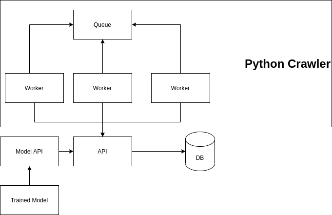

# This s a test project for a job interview

The idea is to create a crawler that will craw until N depth from the initial URL and store in a database.
Then it will generate some features based on that url

## V0.1

### Components:

- Apis 
    - Incremental number of appearances of url
    - Insert url
    - Create url
    - Update url with features on the database

- Crawler - Worker using threads
    - Capture the information from the pages
    - Add new urls to the queue
    - Increment the url appearances
    - Single workers no multiple async requests

- Runner
    - Setup Worker and Queue to run

#### TEsts

Because of the short the time the tests are somewhat generic and only test functionality

### Architectural decisions

####  Apis

Using fastapi  because of percomance, also isolating the databse from direct connections because of componentization.

#### Crawler

Using simple python code, language easy to prototype, using internal queues that can be replaced for other queues

### Possible Future improvements

1. Worker
    - Proxy Rotator
    - Isolate Workers from sending incremental (outside queue)
    - Multiple async calls and load of pages 
    - Priority queue of proxy rotator based on blockage (pull multiple queue pages)
2. Use redis as queue and incremental value
3. Spawn workers using with it's own containers
4. Devops training of the model

P.S: lambda + Pubsub was not considered because of requirements of the project

### Current Architecture

